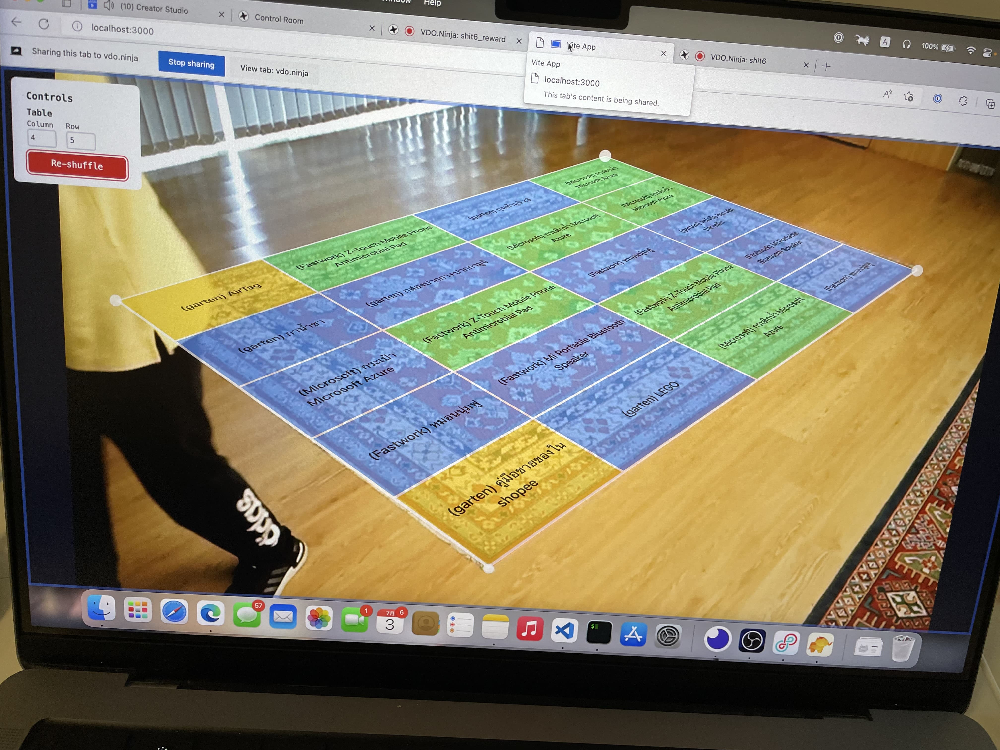

Stupid Randomizer
===



Awarding game for [The ៦th Stupid Hackathon Thailand](https://stupidhackth.github.io/6/)

This game involves both skills, and luck. Comparing the last 5 years that rewards are given by pure luck. And for the first time, mini-game in The Stupid Hackathon Thailand that use combination of physical game, and digital rewarding system all-in-one

What's included?
---

- **React**: Handling table rendering, and data management.
- **jQuery** (yes): `martix3d` pane management.

Setup
---

`DATABASE_URL` environment variables is required to connect to prisma database ([here's how](https://www.prisma.io/docs/concepts/database-connectors/mysql#connection-url)) (`.env` is usable)

First, install dependencies

```
pnpm i
```

Then, setup database with working `DATABASE_URL` with that done then you can deploy database schema.

```
pnpm prisma:migrate-prod
```

Setup data in the database manually, then run entire application with [Vercel CLI](https://vercel.com/docs/cli)

```
vercel dev 
```
